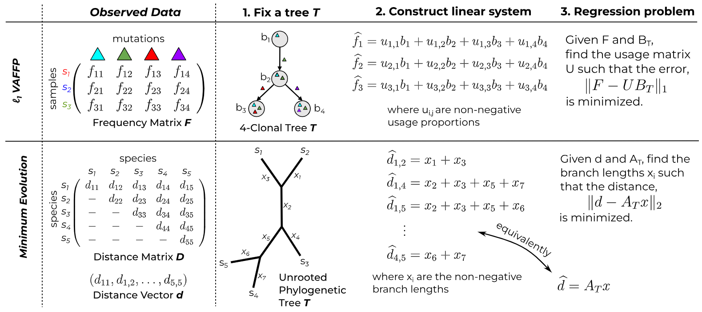

## fastBE: A regression based approach to phylogenetic reconstruction from bulk DNA sequencing of tumors

*fastBE* is a method for inferring the evolutionary history
of tumors from multi-sample bulk DNA sequencing data.
Our method uses ideas from distance based phylogenetics and 
a handcrafted solver of the variant allele frequency 
$\ell_1$-regression problem.



If you find this tool useful in your research, please cite us at:
```
```

### Installation

`fastBE` is implemented in C++ and is packaged with the dependencies
needed to execute the program. In particular, the only dependencies are
a recent version of CMAKE and a modern C++17 compliant compiler.

To build `fastBE` from source, first clone the repository and its submodules:
```
$ git clone --recurse-submodules https://github.com/schmidt73/fastbe.git
```

Then from the root of the project directory, execute the following sequence o
commands:
```
$ mkdir build; cd build
$ cmake ..
$ make
```
The output binary will be located at `build/src/fastbe`.

### Usage

To run *fastbe*, simply execute the binary. 
```
Usage: fastbe [--help] [--version] {regress,search}

Optional arguments:
  -h, --help     shows help message and exits 
  -v, --version  prints version information and exits 

Subcommands:
  regress       Regresses a clone tree onto a frequency matrix.
  search        Searches for a clone tree that best fits a frequency matrix.
```

The two modes of fastbe are `search` and `regress`. The `search` mode
solves the variant allele frequency $\ell_1$-deconvolution problem, 
while the `regress` mode solves the variant allele frequency 
$\ell_1$-regression problem, both of which are defined in 
our manuscript. 

The `search` mode takes as input an $m \times n$ frequency matrix $F$ and outputs
an $n$-clonal tree that best fits the frequency matrix. *Important note: the search
command requires a root vertex specified with the `-f/--assigned-root` flag.*
By default this root vertex is set to be $0$. When the root vertex is unknown,
it suffices to append an extra column to the beginning of the frequency matrix 
and specify the root as $0$.

The `regress` mode
takes as input an $m \times n$ frequency matrix $F$ and an $n$-clonal
tree $\mathcal{T}$ and outputs the minimum value of 
`\lVert F - UB_{\mathcal{T}} \rVert_1` over all usage matrices $U$.

### Input format

The input format for the `search` mode of *fastbe* consists of a frequency 
matrix $F$ in `.txt` format. Rows are separated by newlines
and columns are separated by spaces. Rows correspond
to distinct samples and columns correspond to distinct mutation clusters.
More formally, $F_{ij}$ is the frequency of the $j^{\text{th}}$ mutation
cluster in the $i^{\text{th}}$ sample. As an example, a frequency matrix $F$ 
describing $20$ samples and $10$ clones is:
```
1.0000 0.9801 0.0000 0.8265 0.0156 0.3683 0.2450 0.1218 0.1260 0.0000
1.0000 1.0000 0.0000 0.1257 0.0000 0.0000 0.0000 0.0000 0.0000 0.1436
1.0000 0.5202 0.0000 0.4053 0.5045 0.0000 0.0000 0.1945 0.0000 0.0000
1.0000 0.3497 0.6616 0.1302 0.0000 0.0000 0.0000 0.1558 0.0000 0.0000
1.0000 0.7233 0.1356 0.5780 0.1640 0.0574 0.0785 0.2873 0.0728 0.1083
1.0000 0.8394 0.0646 0.8530 0.0000 0.0000 0.0000 0.0000 0.0000 0.8353
1.0000 0.1309 0.6547 0.0000 0.0174 0.0000 0.0000 0.0000 0.0000 0.0000
1.0000 0.4203 0.1889 0.0000 0.0000 0.0000 0.0000 0.0000 0.0000 0.0000
1.0000 0.2731 0.1406 0.2768 0.4452 0.0000 0.0000 0.0000 0.0000 0.0000
1.0000 0.5346 0.4651 0.5437 0.0000 0.0000 0.0000 0.1311 0.1069 0.0000
1.0000 0.1043 0.0000 0.1258 0.7614 0.0000 0.0000 0.0566 0.0685 0.0562
1.0000 0.8784 0.0000 0.3935 0.0122 0.0000 0.0124 0.2469 0.2382 0.1668
1.0000 1.0000 0.0000 0.0000 0.0000 0.0000 0.0000 0.0000 0.0000 0.0000
1.0000 0.9163 0.0412 0.8878 0.0348 0.1197 0.1299 0.6229 0.4443 0.0010
1.0000 0.9130 0.0418 0.6500 0.0458 0.0000 0.0000 0.0000 0.0000 0.0000
1.0000 0.8923 0.0000 0.9118 0.0000 0.0000 0.0000 0.9092 0.0000 0.0000
1.0000 0.9318 0.0000 0.9369 0.0704 0.0000 0.0000 0.8478 0.8136 0.0000
1.0000 0.4489 0.3422 0.4024 0.1828 0.0270 0.0000 0.3257 0.3120 0.0350
1.0000 0.9753 0.0000 0.8931 0.0000 0.5100 0.0506 0.0682 0.0000 0.1435
1.0000 1.0000 0.0000 1.0000 0.0000 0.0000 1.0000 0.0000 0.0000 0.0000
```

The above frequency matrix $F$ is provided as an input file at `examples/sim_obs_frequency_matrix.txt`.

The input format for the `regress` mode of *fastbe* is the aforementioned
frequency matrix $F$ and an $n$-clonal tree $\mathcal{T}$. The tree is specified
as an adjacency list in `.txt` format. An example of a clonal tree
which consists of $10$ clones rooted at the $0$ vertex is:
```
0 1 2 4
1 3
2
3 5 6 7 9
4
5
6
7 8
8
9
```

The above clonal tree $\mathcal{T}$ is provided as an input file at `examples/sim_tree.txt`.

The above frequency matrix and clonal tree were generated using the command,
`python scripts/simulation.py --clones 20 --samples 10 --coverage 100 --seed 0 --mutations 100 --output examples/sim`
which simulates the evolution of a tumor with $10$ mutation clusters (equivalently, clones) and $20$ samples at a 
read depth of $100\times$ and $100$ mutations distribution across the $10$ mutation clusters.
Several other files such as the mutation to clone mapping, the ground truth usage matrix $U$, clonal
matrix $B$, and read count matrices are also provided in the `examples/` directory.

## Usage Example

As an example, we will infer a phylogenetic tree from the simulated
data with $20$ samples and $10$ clones. To run `fastbe` on this data,
execute:
```
fastbe search examples/sim_obs_frequency_matrix.txt -o examples/fastbe
```
This command will output an adjacency list describing the clonal tree 
at `examples/fastbe_tree.txt` and a `.json` file containing metadata
at `examples/fastbe_results.json`.
